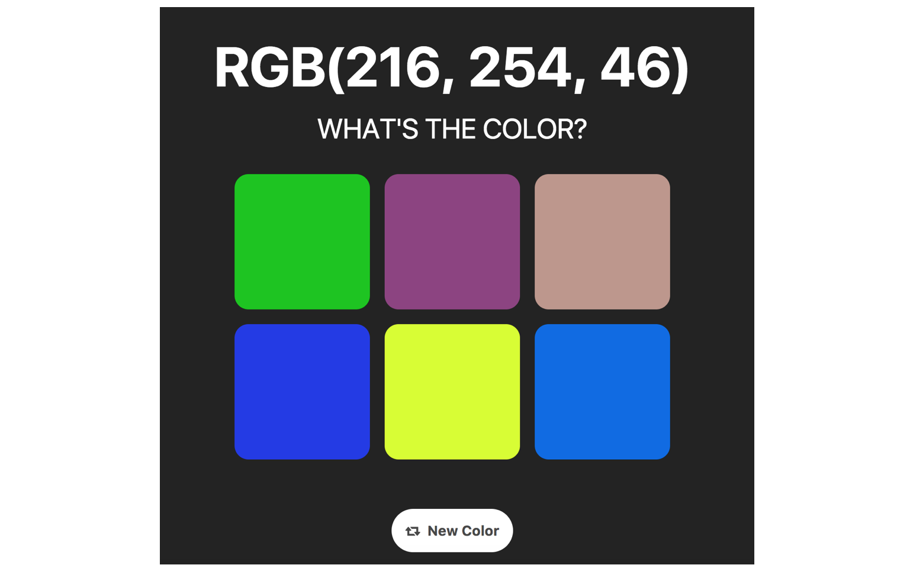
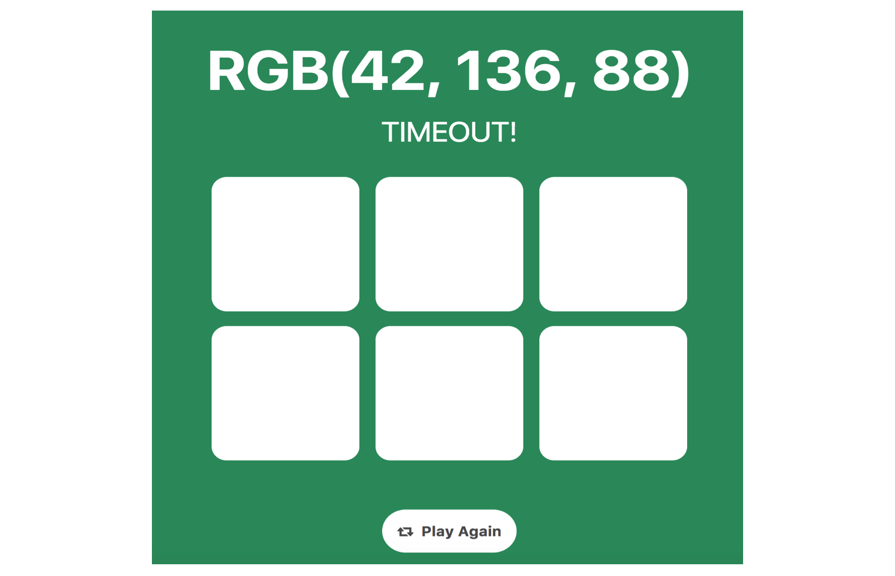

# Pure JavaScript Color Game (Webpack Modularized Structure)
### Checkout My Final Implemented Game: https://cv47522.github.io/js-color-game-webpack/

This version is built and bundled by Webpack module.  
Original non-modular version: https://github.com/cv47522/js-color-game

## Features
### 1. Hard mode
* Mode Button
    * Selected button can display another css form 
    
    * Hoverable Buttons (5%)  
    
    * Display inline
* 3 cards => 6 cards

* Can switch to easy mode and nightmare mode

### 2. Nightmare mode
* Timer
    * Count time from 5 sec to 0 sec
    
    * Time out  
    Display correct background color and show "Time out".
    
* No New Color button when counting down
* Can switch to easy mode and hard mode
* Blink every 1 sec 

### Demo Gif

